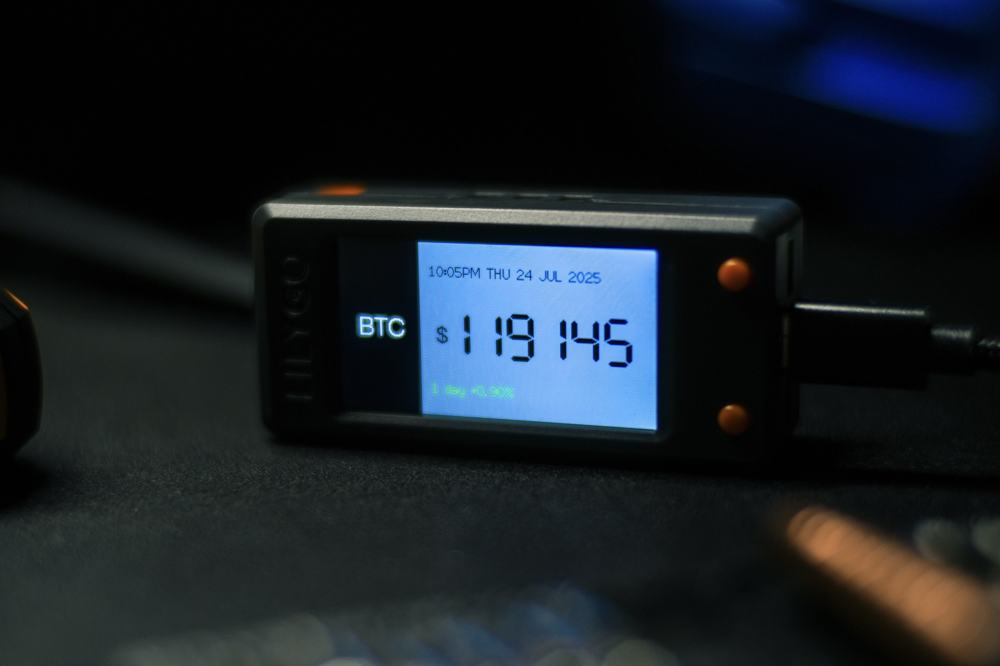

# Bitcoin Ticker for LilyGo T-Display S3

A DIY Bitcoin price ticker for the LilyGo T-Display S3 board, displaying real-time BTC/USD price, 24-hour price change, and current time. The data updates automatically every 2 minutes, and the display features a custom color scheme.

---

## Features

* **Real-time BTC Price:** Fetches Bitcoin price in USD from CoinGecko API.
* **24-hour Price Change:** Shows the percentage change in the last 24 hours, colored green for positive and red for negative.
* **Current Time Display:** Syncs time from NTP server.
* **Always-On Display:** The screen stays on and updates automatically without deep sleep.
* **Customizable Display:**
    * No decimal places for BTC price.
    * Dark side panel for "BTC" text.
    * Grey background for main data display.
    * Bold font for price.

---

## Hardware

* **LilyGo T-Display S3:** An ESP32-S3 development board with a built-in TFT display.

---

## Setup Instructions

1.  **Install Arduino IDE:** If you don't have it, download and install the [Arduino IDE](https://www.arduino.cc/en/software).
2.  **Install ESP32 Board Package:**
    * Open Arduino IDE, go to `File > Preferences`.
    * Add this URL to "Additional Board Managers URLs": `https://raw.githubusercontent.com/espressif/arduino-esp32/gh-pages/package_esp32_index.json`
    * Go to `Tools > Board > Boards Manager...`
    * Search for "esp32" and install **"esp32 by Espressif Systems"** (make sure it's the latest version).
    * **Restart Arduino IDE** after installation.
3.  **Select the Board:** Go to `Tools > Board > ESP32 Arduino` and select **"T-Display-S3"** or **"ESP32S3 Dev Module"**.
4.  **Install Libraries:**
    * Open Arduino IDE, go to `Sketch > Include Library > Manage Libraries...`
    * Search and install the following libraries:
        * `WiFiManager` by Tzapu
        * `ArduinoJson` by Benoit Blanchon
        * `TFT_eSPI` by Bodmer
    * **Configure `TFT_eSPI` for T-Display S3:**
        * Navigate to your Arduino libraries folder (usually `Documents/Arduino/libraries/`).
        * Open the `TFT_eSPI` folder.
        * Find and open the file `User_Setup_Select.h`.
        * Comment out any active `#include <User_Setup.h>` lines.
        * Uncomment the line corresponding to LilyGo T-Display S3, e.g., `#include <User_Setups/Setup207_LilyGo_T_Display_S3.h>` (the exact number might vary slightly).
        * Save the `User_Setup_Select.h` file.
5.  **Upload the Code:**
    * Open the provided `.ino` file in Arduino IDE.
    * Connect your LilyGo T-Display S3 board to your computer.
    * Select the correct COM Port from `Tools > Port`.
    * Click the "Upload" button.
6.  **Configure WiFi:** On the first boot, the board will create an Access Point named "BTC-Ticker-Setup". Connect to this AP from your phone/computer and configure your Wi-Fi credentials via the web portal.

---

## Display Preview

Here's how the BTC Ticker looks on the LilyGo T-Display S3:

---

## Support This Project

If you find this project useful or it helps you, please consider supporting its development. Your contributions, however small, are greatly appreciated and help keep the project alive and growing!

### ⚡ Donate with Bitcoin Lightning ⚡

You can send Satoshis directly to my Lightning Wallet:

**Lightning Address:** `slenderswitch67@walletofsatoshi.com`

**Or simply scan the QR Code:**

**Thank you for every single satoshi you contribute! Your support means a lot.** 🙏

---

## License

This project is licensed under the **Creative Commons Attribution-NonCommercial 4.0 International Public License (CC BY-NC 4.0)**.

This means you are free to:
* **Share** — copy and redistribute the material in any medium or format.
* **Adapt** — remix, transform, and build upon the material.

Under the following terms:
* **Attribution (BY)** — You must give appropriate credit, provide a link to the license, and indicate if changes were made. You may do so in any reasonable manner, but not in any way that suggests the licensor endorses you or your use.
* **NonCommercial (NC)** — You may **not** use the material for commercial purposes. This means you cannot use it to generate revenue.

For the full legal code, please refer to the `LICENSE` file in this repository or visit [Creative Commons BY-NC 4.0](https://creativecommons.org/licenses/by-nc/4.0/legalcode).